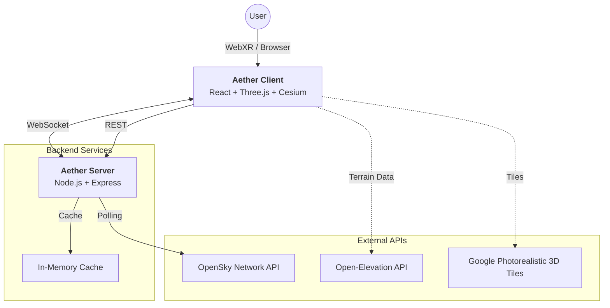

<div align="center">
  
  <br />

# Aether. Unlike any other.

### Immersive Real-Time VR Flight Tracker

[](LICENSE)
[](https://www.typescriptlang.org/)
[](https://reactjs.org/)
[](https://immersiveweb.dev/)

**[🚀 Live Demo](https://aether-app.up.railway.app/)** | **[📖 Contributing](CONTRIBUTING.md)**

  <p align="center">
    Experience live air traffic control from your living room. <br/>
    Visualize real-time flight data in a stunning 3D environment using the power of the web.
  </p>
</div>

---

## ✨ Overview

**Aether** turns global air traffic data into a tangible reality. Built for both desktop and VR headsets (Meta Quest etc.), it fetches live flight positions from the **OpenSky Network** and renders them in high-fidelity 3D. Whether you're a flight enthusiast or just love data visualization, Aether puts you in the center of the airspace.

### Key Features

- **🥽 WebXR Immersive Mode**: Step into the map with full VR support for Meta Quest and compatible headsets.
- **✈️ Real-Time Tracking**: Live position updates via WebSocket for butter-smooth aircraft movement.
- **🌍 3D Geospatial Environment**: Powered by **Google Photorealistic 3D Tiles** for immersive cities and landscapes, layered over **Cesium World Terrain** for global accuracy.
- **🎯 Interactive Inspection**: "Laser point" at aircraft to reveal detailed telemetry (speed, altitude, airline, trajectory).
- **📍 Location Freedom**: Teleport anywhere in the world to monitor local airspace.

## 💡 Real-Life Use Cases

- **🛩️ Plane Spotting 2.0**: Identify the exact flight flying over your house in real-time AR/VR just by looking up.
- **🎓 Aviation Education**: Visualize flight corridors, approach paths, and air traffic density in a tangible 3D space.
- **🧘 Immersive Relaxation**: Teleport to a busy airport like Heathrow or Haneda and watch the traffic flow from a "God Mode" perspective.

## 🏗️ Architecture

Aether is built on a modern full-stack architecture tailored for low-latency visualization.



### Tech Stack

- **Frontend**: React, Three.js (via React Three Fiber), CesiumJS, TailwindCSS.
- **Backend**: Node.js, Express, WebSocket.
- **Data Sources**: OpenSky Network (Flights), Open-Elevation (Terrain).
- **DevOps**: Docker, Docker Compose.

## 🚀 Getting Started

### Prerequisites

- **Node.js** v18+
- **npm** or **pnpm**
- **Git**

### Installation

1.  **Clone the repository**

    ```bash
    git clone https://github.com/Splestule/Aether.git
    cd Aether
    ```

2.  **Install dependencies**

    ```bash
    npm run install:all
    ```

3.  **Configure Environment**
    Create a `.env` file in the `server/` directory. You can copy the example:

    ```bash
    cp server/env.example server/.env
    ```

    > **Note**: For higher rate limits, add your OpenSky credentials to `.env`.

4.  **Launch Aether**
    ```bash
    npm run dev
    ```
    This spins up the backend on port `8080` and the frontend on port `3000`.

### 🔑 Bring Your Own Key (BYOK)

Aether supports a "Bring Your Own Key" (BYOK) feature that allows users to provide their own OpenSky Network credentials for enhanced API access.

#### Enabling BYOK

To enable BYOK mode, set the `BYOK` environment variable to `true` in your server `.env` file:

```bash
BYOK=true
```

When `BYOK=false` (default), the app behaves exactly as before, using only server-configured credentials.

#### How It Works

When BYOK is enabled:

- **Without User Credentials**: Users have limited API access (10 requests per minute)
- **With User Credentials**: Users get full API access (same quota as server credentials)

Users can provide their OpenSky credentials through the frontend interface. Credentials are:

- Validated before being accepted
- Stored securely in a session token (expires after 24 hours)
- Never logged or exposed in server logs
- Transmitted over HTTPS (recommended for production)

#### Security Considerations

- Session tokens are cryptographically secure (UUID v4)
- Credentials are validated before session creation
- Sessions automatically expire after 24 hours
- Use HTTPS in production for secure credential transmission
- Rate limiting prevents abuse

#### User Experience

When BYOK is enabled, users will see an "OpenSky Credentials" option in the location selector screen. They can:

- Enter their OpenSky Client ID and Client Secret
- View their current session status
- Remove their credentials at any time

### 🐳 Docker Usage

Prefer containers? We got you.

```bash
docker compose up --build
```

Access the app at `http://localhost:3000`.

## 🎮 Controls

| Action                  | Desktop    | VR Controller                       |
| :---------------------- | :--------- | :---------------------------------- |
| **Move Camera**         | Mouse Drag | Thumbstick                          |
| **Select Flight**       | Left Click | Laser Pointer + Trigger             |
| **Calibrate Direction** |            | Left Controller Trigger + Rotate It |
| **Change Mode**         | UI Buttons | UI Buttons (In browser)             |

## 📂 Project Structure

```text
Aether/
├── client/              # React application (Vite)
│   ├── src/
│   │   ├── components/  # 3D & UI Components
│   │   └── hooks/       # Flight data logic
├── server/              # Node.js Express API
│   ├── src/
│   │   └── services/    # Data fetching & Caching
├── shared/              # Types shared between Front/Back
├── docker-compose.yml   # Container orchestration
└── README.md            # You are here
```

## 📄 License

This project is licensed under the **MIT License** - see the [LICENSE](LICENSE) file for details.

---

<p align="center">
  <b>Built with ❤️ by Eduard Šimon</b>
  <br/>
  <span style="font-size: 0.8em">Data provided by OpenSky Network</span>
</p>
