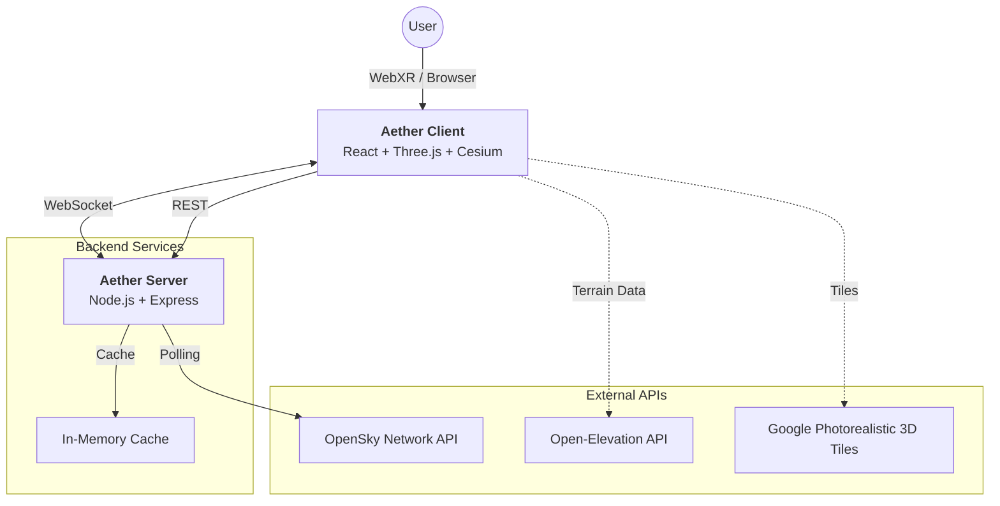

<div align="center">
  
  <br />

# Aether

### Real-Time VR Flight Tracker

[](LICENSE)
[](https://www.typescriptlang.org/)
[](https://reactjs.org/)
[](https://immersiveweb.dev/)

**[Live Demo](https://aether-app.up.railway.app/)** | **[Contributing](CONTRIBUTING.md)**

</div>

---

## What is Aether?

Aether is a flight tracker built for VR. Put on a Meta Quest (or any WebXR headset), look up at the sky, and see real planes exactly where they're flying — live positions, correct direction, the whole thing.

It also works on desktop as a 3D flight map, and on mobile as an AR experience. You can teleport anywhere in the world, watch traffic flow in real-time, and inspect individual flights for details like altitude, speed, and trajectory.

Built on OpenSky Network data, rendered with Google Photorealistic 3D Tiles and Cesium terrain.

## Achievements & Recognition

> 🏆 **3rd Place** — Czech Electrotechnical Olympiad (2025)
>
> **Featured in:** [Feedit.cz](https://feedit.cz/2025/12/19/robot-pro-vyuku-i-prenos-soucastek-to-je-vitezny-projekt-letosni-elektrotechnicke-olympiady/), [Hitrádio Vysočina](https://hitradiovysocina.cz/novinky/studenti-z-gymnazia-ve-zdaru-nad-sazavou-bodovali-v-elektronicke-olympiade), [Žďárský Deník](https://zdarsky.denik.cz/zpravy_region/zdar-gymnazium-student-uspech-celostatni-soutez-zajimava-aplikace-letovy-provoz.html), [Kraj Vysočina](https://www.kr-vysocina.cz/eduard-simon-ze-zdarskeho-gymnazia-uspel-v-celostatni-soutezi-ziskal-bronz-v-elektrotechnicke-olympiade/d-4135702)

### Features

- **VR support** — Full WebXR mode for Meta Quest and other compatible headsets
- **Live tracking** — Real-time position updates via WebSocket
- **3D environment** — Google Photorealistic 3D Tiles + Cesium World Terrain
- **Flight inspection** — Point at aircraft to see telemetry data
- **Global coverage** — Teleport anywhere to monitor local airspace

## Architecture



### Tech Stack

- **Frontend**: React, Three.js (React Three Fiber), WebXR, CesiumJS, TailwindCSS
- **Backend**: Node.js, Express, WebSocket
- **Data**: OpenSky Network (flights), Open-Elevation (terrain)
- **DevOps**: Docker, Docker Compose

## Getting Started

### Prerequisites

- Node.js v18+
- npm or pnpm
- Git

### Installation

1. Clone the repo

    ```bash
    git clone https://github.com/Splestule/Aether.git
    cd Aether
    ```

2. Install dependencies

    ```bash
    npm install
    ```

3. Set up environment variables

    ```bash
    cp server/env.example server/.env
    ```

4. Build the shared package (required once before first run)

    ```bash
    npm run build
    ```

5. Start the dev server

    ```bash
    npm run dev
    ```

    Backend runs on port `8080`, frontend on port `3000`.

### Bring Your Own Key (BYOK)

You can use your own OpenSky Network credentials for better API access.

To enable it, set this in your `server/.env`:

```bash
BYOK=true
```

When enabled:
- **Without credentials**: Limited API access (10 requests/min)
- **With credentials**: Full API access

Users can enter their OpenSky credentials through the UI. Credentials are validated, stored in a session token (24h expiry), and never logged.

### Docker

```bash
# Build and run
docker compose up --build

# Or detached
docker compose up -d --build

# Stop
docker compose down
```

| Service | URL | Port |
|---------|-----|------|
| Frontend | http://localhost:4173 | 4173 |
| Backend | http://localhost:8080 | 8080 |

Create a `.env` file in the project root:

```bash
OPENSKY_CLIENT_ID=your_client_id
OPENSKY_CLIENT_SECRET=your_client_secret
```

### Dashboard

Aether includes a built-in dashboard for monitoring server status, viewing logs, and managing processes.

- **URL**: `http://localhost:8081`
- **Features**:
  - Start/Stop servers
  - View real-time logs (Backend, Frontend)
  - Toggle Debug Mode
  - Monitor OpenSky API connection status

To run the dashboard independently:

```bash
npm run dashboard
```

(Note: The dashboard starts automatically when running `npm run dev` via the start script).

## Controls

| Action | Desktop | VR Controller |
|:-------|:--------|:--------------|
| Move Camera | Mouse Drag | Thumbstick |
| Select Flight | Left Click | Laser Pointer + Trigger |
| Calibrate Direction | — | Left Trigger + Rotate |
| Change Mode | UI Buttons | UI Buttons (in browser) |

## Project Structure

```text
Aether/
├── client/              # React app (Vite)
│   ├── src/
│   │   ├── components/  # 3D & UI components
│   │   └── hooks/       # Flight data logic
├── server/              # Node.js Express API
│   ├── src/
│   │   └── services/    # Data fetching & caching
├── shared/              # Shared types
├── docker-compose.yml
└── README.md
```

## License

MIT — see [LICENSE](LICENSE) for details.

---

<p align="center">
  Built by Eduard Šimon
  <br/>
  <span style="font-size: 0.8em">Data provided by OpenSky Network</span>
</p>
